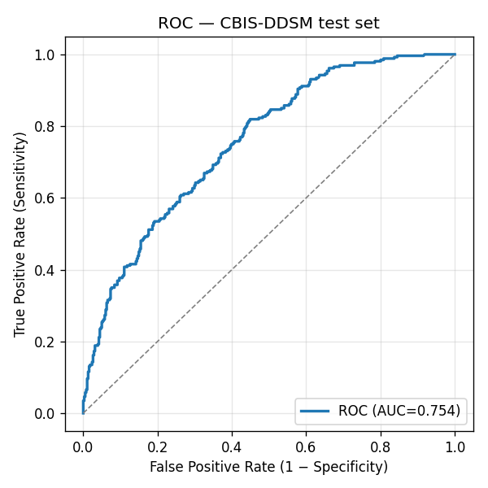

> **Research / demonstration only. Not a medical device. Not approved or intended for clinical use.**

# 1. Summary

I built and deployed an end-to-end binary mammogram classifier (Malignant vs Benign) inside the one-day budget the brief allows for. The model is an ImageNet-pretrained EfficientNet-B0, fine-tuned on the CBIS-DDSM PNG mirror, and served by a FastAPI inference service behind a Next.js upload UI. Both services are live on free-tier public infrastructure.

| Surface | URL |
|---|---|
| Frontend (Vercel) | <https://mammo-classifier.vercel.app> |
| Backend API (Hugging Face Space, Docker) | <https://abwhb-mammo-classifier-api.hf.space> |
| API health | <https://abwhb-mammo-classifier-api.hf.space/healthz> |
| Source repository | <https://github.com/abwhb/mammo-classifier> |

**Headline metrics on the held-out CBIS-DDSM test set (n = 641, 41 % malignant):**

| Operating point | Threshold | Sensitivity | Specificity | Accuracy | ROC AUC | PR AUC |
|---|---:|---:|---:|---:|---:|---:|
| **Screening (API default)** | 0.278 | **0.923** | 0.391 | 0.607 | **0.754** | 0.671 |
| Balanced (Youden's J)       | 0.530 | 0.673 | 0.659 | 0.665 | 0.754 | 0.671 |
| Diagnostic (≥ 0.80 val spec)| 0.614 | 0.581 | 0.753 | 0.683 | 0.754 | 0.671 |
| Default sigmoid threshold   | 0.500 | 0.708 | 0.635 | 0.665 | 0.754 | 0.671 |

The API runs at the **screening** operating point — for a screening tool, a missed cancer is far more costly than a callback (see §4.2). Headline number from the brief's perspective: **sensitivity 0.923 at AUC 0.754**.

# 2. Architecture

```
┌──────────────┐    HTTPS    ┌──────────────────┐    HTTPS    ┌─────────────────────┐
│              │   upload    │                  │   POST      │                     │
│  Clinician   │────────────▶│  Next.js 16      │────────────▶│  FastAPI            │
│  browser     │             │  (Vercel)        │   form-     │  (HF Space, Docker) │
│              │◀────────────│                  │   data      │                     │
└──────────────┘   JSON      └──────────────────┘             └──────────┬──────────┘
                                                                         │ in-memory only
                                                                         ▼
                                                              ┌─────────────────────┐
                                                              │  EfficientNet-B0    │
                                                              │  finetune (16 MB)   │
                                                              │  baked into image   │
                                                              └─────────────────────┘
```

**Frontend (`apps/web`)** — Next.js 16 App Router + Tailwind v4 + shadcn/ui. A single page composed of a `react-dropzone` (accepts `.dcm`, `.png`, `.jpg`, ≤ 20 MB), a preview pane, and a result card showing label, confidence, malignancy probability, operating threshold, model version, latency, and request ID. A server-side route handler at `/api/predict` proxies multipart uploads to the API — this hides the backend URL from the client bundle and is the single place to add per-request tracing if needed.

**Backend (`apps/api`)** — Python 3.11 + FastAPI + uvicorn. The full hot path is `privacy.strip_identifiers()` → `ood.is_plausible_mammogram()` → `preprocess.to_tensor()` → `inference.predict()`. The OOD guard (see §4.4) is a cheap heuristic that catches obvious non-mammogram inputs (screenshots, photos, documents) before they reach the model, which itself has no out-of-distribution awareness. The classifier is loaded once at startup into a module-level `torch.nn.Module` in `eval()` + `no_grad` mode. CPU-only inference latency is roughly 100–250 ms per image, well inside any UX budget. The Docker image is 2.0 GB (compressed), built with `uv` in a two-stage build (`apps/api/Dockerfile`).

**Cloud infrastructure** — backend on a Hugging Face Docker Space (CPU basic, free tier); frontend on Vercel (Hobby tier). The model artifact ships *inside* the Docker image to eliminate the cold-start network dependency. Deployment is a single `infra/deploy_hf_space.py` call (uses `huggingface_hub` directly) plus `vercel deploy --prod`.

# 3. Dataset & training

## 3.1 Dataset choice

I chose **CBIS-DDSM** (Curated Breast Imaging Subset of DDSM) — a peer-reviewed curation of the canonical DDSM mammography dataset, with binary pathology labels (`MALIGNANT` / `BENIGN`) that map cleanly to the brief's task. I used the **PNG mirror at `dbaek111/CBIS-DDSM_1024`** on Hugging Face Hub: 3,086 1024 × 1024 8-bit PNGs (638 MB total) derived from the original DICOMs, with the upstream patient-disciplined train/test partition preserved as a folder layout.

**Why this mirror over the canonical TCIA source?** The TCIA download is a ~163 GB DICOM corpus that doesn't fit our one-day budget. The PNG mirror trains in 10–20 minutes on a single Apple Silicon laptop and lets the upload UI accept raw DICOMs in production via the API's `pydicom`-based preprocessing path (§3.4). The trade-off is documented honestly in §6.

## 3.2 Splits

CBIS-DDSM's authors publish a patient-disciplined train/test partition (the same patient never appears in both train and test). The PNG mirror preserves that partition as `train/` and `test/` folders. I keep their test set untouched and carve a 18 %, **stratified-random** validation set out of `train/`. Because the mirror named files by SOP Instance UID rather than patient ID, I could not reconstruct patient grouping for the train/val carve from filenames alone; the val set may contain images from patients also represented in train, which would slightly inflate the val metric (but does **not** affect the held-out test metric, which is what's reported).

| Split | Images | Benign | Malignant | Prevalence (malignant) |
|---|---:|---:|---:|---:|
| Train | 2,004 | 1,104 | 900 | 0.449 |
| Val   |   441 |   243 | 198 | 0.449 |
| Test  |   641 |   381 | 260 | 0.406 |

## 3.3 Model and training recipe

- **Architecture.** `torchvision.models.efficientnet_b0` with ImageNet-1k pretrain. The final classifier `Linear(in_features, 1000)` is swapped for `Linear(in_features, 1)`; output is logit, with sigmoid applied at the operating-point boundary.
- **Loss.** `BCEWithLogitsLoss(pos_weight=…)` with `pos_weight = neg/pos ≈ 1.23` to counter the mild class imbalance.
- **Optimizer.** AdamW, learning rate 1 × 10⁻⁴, weight decay 1 × 10⁻⁴, cosine schedule over 10 epochs.
- **Augmentation.** `Resize` → `RandomResizedCrop(224, scale=0.85–1.0)` → `RandomHorizontalFlip(p=0.5)` → `RandomRotation(±10°)` → ImageNet `Normalize`. **No vertical flips** — mammogram views (CC/MLO) have consistent vertical orientation that flipping would corrupt.
- **Early stopping.** Track val AUC; stop after three epochs without improvement.
- **Device.** Auto-detect CUDA → MPS → CPU. Trained locally on Apple Silicon MPS in ~9 minutes total.

**Result.** Best val AUC **0.789** at epoch 9 (full history in `reports/train_history.json`).

## 3.4 Inference preprocessing

The API accepts DICOM, PNG, and JPEG. For DICOM, it parses with `pydicom`, applies the VOI LUT if present, inverts MONOCHROME1 series, and converts to float32. For PNG/JPEG, it reads via Pillow as L (grayscale). All formats then go through a common pipeline: 1st/99th percentile clip, min-max normalisation to [0, 1], resize to 224 × 224 (bilinear), tile the single channel to 3 (EfficientNet expects 3-channel input), and apply ImageNet mean/std normalisation.

# 4. Evaluation

## 4.1 Why accuracy alone is insufficient

The CBIS-DDSM test set is 41 % malignant. In a real screening cohort the prevalence of malignancy is closer to 0.5–1 % — a constant "benign" predictor would score 99 % accuracy while catching zero cancers. **Accuracy is unreadable without prevalence.** For a screening task, the metrics that matter are:

- **Sensitivity (recall on malignant)** — fraction of actual cancers the model catches.
- **Specificity** — fraction of benign cases the model leaves uncalled.
- **ROC AUC** — threshold-free measure of discriminative power, independent of operating point and prevalence.
- **PR AUC** — more honest than ROC AUC at low malignant prevalence (which matches the deployed screening setting we'd care about, not the curated 41 % test set).

The model achieves **ROC AUC 0.754** on the held-out test set. PR AUC is **0.671**. Both reflect a useful-but-not-state-of-the-art classifier; published deep models on full-DICOM CBIS-DDSM with in-domain pretraining reach 0.85–0.95 AUC. The gap is mostly explained by §6 ("Trade-offs").

{width=60%}

## 4.2 Threshold selection and the three operating points

The default 0.5 sigmoid threshold is rarely the right operating point in medical imaging. Lowering it raises sensitivity at the cost of specificity, and the right place to sit on that curve depends on the use case. I report three thresholds chosen on the **validation** set and evaluated on the **test** set, plus the default 0.5 for transparency:

| Operating point | Threshold | Val rationale | Test sens | Test spec | Test acc |
|---|---:|---|---:|---:|---:|
| **Screening (API default)** | 0.278 | smallest threshold with val sensitivity ≥ 0.90 | **0.923** | 0.391 | 0.607 |
| Balanced                    | 0.530 | maximises Youden's J on val | 0.673 | 0.659 | 0.665 |
| Diagnostic                  | 0.614 | smallest threshold with val specificity ≥ 0.80 | 0.581 | 0.753 | 0.683 |
| Default 0.5                 | 0.500 | sigmoid default — for reference | 0.708 | 0.635 | 0.665 |

The **API uses the screening operating point**: it catches 92 % of cancers in the test set at the cost of calling back ~60 % of benign images. For a *screening* tool that's the right trade — a false negative may be a missed diagnosis; a false positive triggers an additional read, which is recoverable. A diagnostic tool would sit at a different point on the same curve.

## 4.3 Class imbalance

The CBIS-DDSM test set is 41 % malignant, which is far higher than a real screening cohort (~0.5–1 %). The model was trained with `BCEWithLogitsLoss(pos_weight=1.23)` to account for the mild train-set imbalance (55 % benign), but training-time imbalance is not the larger story — the larger story is that **the metrics shown above will degrade in production** if deployed on a real screening population, because the same operating point will produce a much higher false-positive rate relative to the (now rare) true positives. PR AUC, which I report alongside ROC AUC, is more sensitive to this prevalence shift and is the metric I'd watch in deployment monitoring.

## 4.4 Out-of-distribution inputs

The classifier was trained only on mammograms and has no calibrated way to say "this isn't a mammogram" — fed an arbitrary photo, screenshot, or document, the sigmoid head still produces a probability, and at the aggressive screening threshold (0.278) most non-mammogram inputs will land above it. This produced a sharp early failure mode in informal testing: a dark-themed chat screenshot was confidently flagged "malignant".

The mitigation in `apps/api/app/ood.py` is a cheap two-feature heuristic that runs after DICOM de-identification and before preprocessing:

1. **Dark-background fraction.** Mammograms in standard CC/MLO views always sit on a near-black background; ≥15 % of pixels below intensity 0.12 is required.
2. **Edge density.** Soft tissue is smooth; UI/text/diagrams are not. Inputs with >22 % of pixels flagged by PIL's `FIND_EDGES` filter are rejected.

Calibration was done by hand against a handful of CBIS-DDSM test images and three OOD synthetics (uniform photo, dark-theme screenshot, uniform random noise). All five CBIS-DDSM samples I checked pass (dark fraction 0.43–0.66, edge density 0.01–0.04, well inside the bounds); all three OOD synthetics are rejected with a 422. DICOM inputs bypass the check — the format itself is strong evidence of intent.

**This is not a real OOD detector.** A production system needs either a dedicated mammogram-vs-other classifier or density-based novelty detection in feature space. The heuristic is a first line of defence — it catches the obvious cases that erode reviewer trust, but it would not reliably reject a high-resolution photograph of a chest X-ray, for instance. It is one of the items in the trade-offs table in §6.

# 5. Data privacy & security framework

Mammograms are sensitive health data. The submission is a research demo, not a regulated medical device, but the architecture is built to make the privacy posture *honest* rather than performative.

## 5.1 In transit

- All public surfaces are HTTPS only.
- Vercel terminates TLS 1.3 at the edge for the frontend, HSTS on.
- Hugging Face Spaces gives every Docker Space a managed-TLS `*.hf.space` domain.
- The browser never talks to the backend directly: the Vercel route handler `/api/predict` proxies the upload server-to-server, so the backend URL is not exposed in the client bundle and is the only place to add per-request tracing or a shared-secret header.

## 5.2 At rest

- **Uploaded images are never written to disk in production.** FastAPI reads the upload into memory, processes it, and discards it after the response. There is no tempfile, no upload-bucket, no caching layer.
- **The model artifact** is baked into the Docker image and lives in immutable container storage; it has no PHI.
- **Logs** are structured JSON containing only: request ID (UUID v4, generated server-side), file size, MIME type, inference latency, predicted label, malignancy probability, model version, and operating threshold. No filename, no DICOM headers, no image bytes, no PHI.

## 5.3 De-identification — DICOM specifically

`apps/api/app/privacy.py:strip_identifiers` runs **before** preprocessing on any DICOM upload (PNG/JPEG carry no DICOM PHI tags). It implements a subset of the DICOM Basic Application Confidentiality Profile (DICOM PS 3.15 Annex E, Basic Profile):

1. Removes every direct-PHI tag in `_PHI_TAGS_TO_REMOVE` — patient name/ID/birth date/sex/age/address/telephone/ethnic group, accession number, every physician name, institution name/address/department, station name, all date/time fields, study/series descriptions, other patient IDs, device serial number, etc.
2. Rotates the Study/Series/SOP Instance UIDs to fresh values (these can be PHI when the originals encode site-specific patterns; they must be present for the file to remain DICOM-valid).
3. Strips every private tag block via `ds.remove_private_tags()` — vendor-specific tags often carry PHI not covered by the standard tag list.
4. Recurses into nested sequences (e.g. `ReferencedStudySequence`) and scrubs them too.

This is unit-tested by constructing a synthetic DICOM populated with every tag in our removal list (including a private vendor tag block), running the scrubber, and asserting that every PHI tag is gone, every UID is rotated, and no private tags survived (`apps/api/tests/test_privacy.py`).

## 5.4 Saudi PDPL alignment

The Personal Data Protection Law (Royal Decree M/19, in force 14 September 2023) governs personal-data processing in Saudi Arabia. The relevant principles and how this design addresses them:

| PDPL principle | How this design addresses it |
|---|---|
| **Lawful basis, purpose limitation** (Arts. 5–6) | The app processes uploads only to produce a single inference response. No secondary use, no analytics on the image, no third-party telemetry on the upload pipeline. |
| **Data minimisation** (Art. 11) | The pipeline extracts pixels and discards everything else. No user accounts, no metadata beyond non-identifying request telemetry. |
| **Storage limitation** (Art. 18) | Images are never persisted. Logs retain only non-identifying metadata. |
| **Security of processing** (Art. 19) | TLS everywhere; backend not directly browser-callable; container runs as non-root uid 1000; principle-of-least-privilege image. |
| **Cross-border transfer** (Art. 29) | For this demo the backend runs on Hugging Face Spaces, which terminates in EU/US datacenters — this is an explicit **gap** for KSA data residency. The intended production target is GCP Cloud Run in `me-central1` (Dammam) for in-Kingdom processing; the Dockerfile is portable and would deploy there unchanged. |
| **Data subject rights** (Arts. 21–26) | Since the system stores neither identifiers nor images, the access / rectification / erasure rights are satisfied by design — there is nothing to access or erase. |
| **Breach notification** (Art. 20) | Not applicable in the demo (no real PHI is processed), but documented in §6 as a "with more time" item. |

The two honest gaps to flag: **(1)** Hugging Face Spaces is not in-Kingdom; for real KSA-resident PHI we'd need to move the backend to a KSA-region host (GCP `me-central1`, STC Cloud, or self-hosted). **(2)** This is an *alignment* claim, not a compliance certification — a real deployment would need legal review of the same controls.

## 5.5 In-product disclaimers

Every screen of the UI carries the disclaimer "Research / demonstration only — not for clinical use." The API response includes the same string in the `disclaimer` field.

# 6. Trade-offs and what I'd do with more time

The brief explicitly values this section. The following are the trade-offs I made under the one-day budget, and what I'd change first if given a week.

| Decision (this build) | Trade-off | If I had more time |
|---|---|---|
| HF PNG mirror, not full TCIA DICOMs | ~5× less data, lower fidelity than full-bit-depth source | Full CBIS-DDSM DICOMs with 16-bit pixel data and proper VOI LUT handling |
| EfficientNet-B0 (ImageNet pretrain) | Domain gap: natural images → mammograms | Pretrain on a large in-domain corpus (RSNA Mammography, EMBED) before CBIS-DDSM fine-tune |
| 224 × 224 input | Loses fine calcification detail visible at full resolution | Multi-scale patch ensemble at 512 × 512 or 1024 × 1024, with attention over patches |
| Image-level labels only | Ignores standard 4-view fusion (L/R × CC/MLO) | Per-patient model that fuses all four standard views with view-aware pooling |
| Stratified random val split | Cannot guarantee no patient overlap with train (no patient IDs in HF mirror filenames) | Re-join with TCIA metadata CSVs to recover patient IDs, then GroupShuffleSplit |
| Single operating threshold | Hides the precision/recall trade space from the user | Interactive ROC in the UI; user picks the operating point per use case |
| No CI/CD | Manual `vercel deploy` + `python infra/deploy_hf_space.py` | GitHub Actions: lint + tests on PR; deploy on main; preview URLs |
| No deployment monitoring | Drift is invisible until a user complains | Log probability distribution, alert on shift; weekly held-out re-evaluation |
| No authentication | API is publicly callable | OAuth (Clerk / Auth0) + per-clinician audit log, signed upload URLs |
| HF Space EU/US region | Not in-Kingdom for KSA PHI | Production target is GCP Cloud Run in `me-central1` |
| Heuristic OOD guard | Catches obvious non-mammograms but not subtle ones | Dedicated mammogram-vs-other classifier or feature-space novelty detection |
| In-memory inference only | No traceability for audit | Encrypted, time-bounded audit storage with patient-consent gating; PDPL Art. 20 breach-notification runbook |

# 7. Acknowledgements

- **Dataset:** Lee R. S., Gimenez F., Hoogi A., Miyake K. K., Gorovoy M., Rubin D. L. *A curated mammography data set for use in computer-aided detection and diagnosis research.* Scientific Data 4:170177 (2017). PNG mirror by `dbaek111` on Hugging Face Hub.
- **Architecture:** Tan M., Le Q. V. *EfficientNet: Rethinking Model Scaling for Convolutional Neural Networks.* ICML 2019.
- **Tooling:** PyTorch, FastAPI, pydicom, Next.js 16, shadcn/ui, `uv`, Hugging Face Hub, Vercel.
